# JobHub

A skills-first hiring and collaboration platform. JobHub matches candidates to jobs using what they can actually do. It compares their profile and their public developer activity with each role using a custom-trained text-embedding model, and it checks skills with in-browser coding, SQL and design assessments. Candidates can also form project teams, with suggested members chosen for the skills the team is still missing.

_This project was developed as part of Project III (Semester VI) and is complete. There are no plans for further development or updates._

---

## Overview

Most job boards rank people by keyword overlap with a job description. JobHub tries to answer two questions:

1. **How well does this person fit this role?** The candidate's JobHub profile and connected platforms (GitHub, Stack Overflow, Dev.to, ORCID) are turned into semantic embeddings and compared with the job. The result is a transparent, per-source match score.
2. **Can they actually do the work?** Employers attach practical assessments to a listing: programming, SQL or HTML/CSS design. Candidates complete them in the browser, and the backend grades them automatically in isolated sandboxes.

JobHub has two user types, **candidates** and **employers**, and a third space where candidates can **collaborate** on side projects.

---

## Features

### For candidates

- **Personalised job feed.** A "For you" tab ranks open roles by profile match, alongside a "Latest jobs" tab.
- **Job search.** Search by role, company and location, with filters for workplace (remote, hybrid, on-site) and job type, sortable by best match.
- **Explainable match score.** Every job page shows how well your profile fits the role, broken down by source and weight.
- **Applications with assessments.** Apply with an optional note to the hiring team. If a role requires assessments, submitting the last one sends the application.
- **Tracking.** Saved jobs, application tracking and recent activity in one dashboard.
- **Connected profiles.** Link GitHub, Stack Overflow, Dev.to and ORCID so your public work counts toward your match.

<table>
  <tr>
    <td>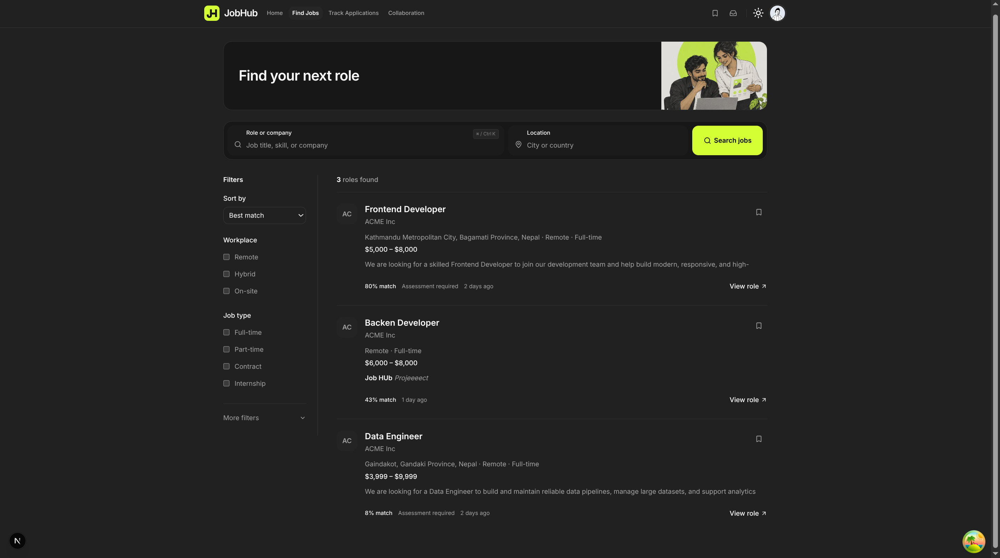</td>
    <td>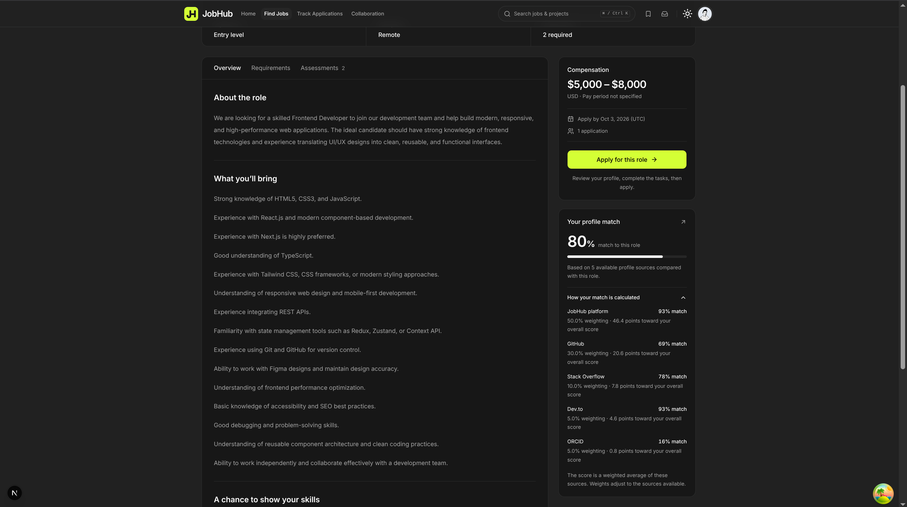</td>
  </tr>
  <tr>
    <td align="center"><sub>Job search ranked by match</sub></td>
    <td align="center"><sub>Job details with match breakdown by source</sub></td>
  </tr>
</table>

### Skill assessments

Employers can attach three kinds of assessment to a job. All of them run in a monitored workspace that records tab and app switches against a warning limit.

| Type                  | What the candidate does                                                           | How it is graded                                                                                                        |
| --------------------- | --------------------------------------------------------------------------------- | ----------------------------------------------------------------------------------------------------------------------- |
| **Programming**       | Solves a problem in **Java** or **Python** in a code editor                       | Runs against test cases inside isolated **Docker** sandboxes                                                            |
| **SQL**               | Writes queries against a described schema                                         | Runs in a fresh in-memory **H2** database per submission and checks the result                                          |
| **Design (HTML/CSS)** | Recreates a reference UI with live preview, slide-compare and difference overlays | Rendered with headless Chromium (**Playwright**) and compared pixel by pixel with the target against a required match % |

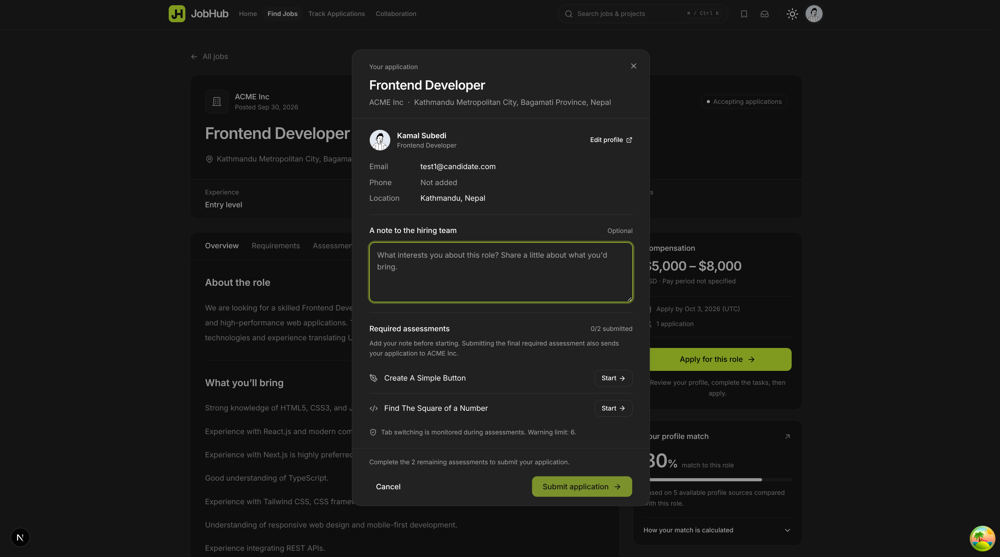

<table>
  <tr>
    <td>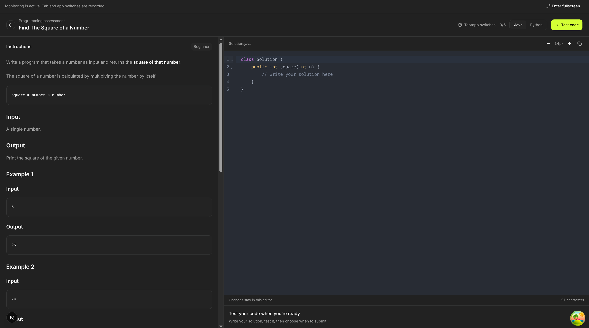</td>
    <td>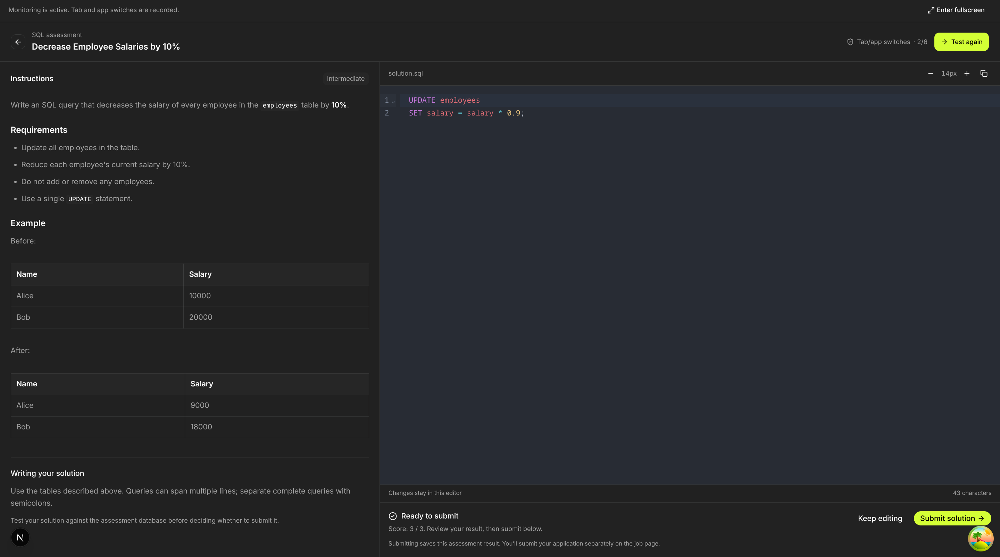</td>
  </tr>
  <tr>
    <td align="center"><sub>Programming assessment (Java / Python)</sub></td>
    <td align="center"><sub>SQL assessment</sub></td>
  </tr>
  <tr>
    <td colspan="2">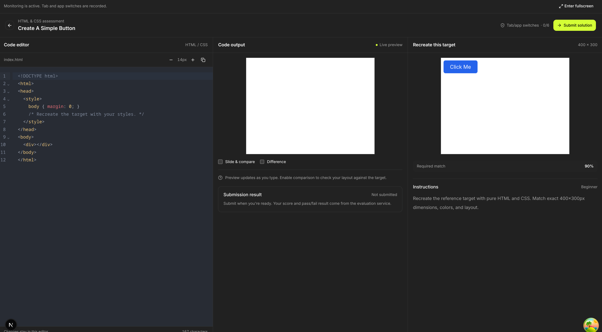</td>
  </tr>
  <tr>
    <td colspan="2" align="center"><sub>Design assessment: recreate the target with HTML/CSS</sub></td>
  </tr>
</table>

### For employers

- **Job listings.** Create, edit and publish roles with compensation, deadlines, requirements and required assessments.
- **Candidate review.** See each applicant's profile, job match score and per-source evidence in one place.
- **Submitted work.** Read the question, the candidate's code (read only) and, for design tasks, a rendered preview next to the reference.
- **Pipeline.** Move applicants through stages: shortlist, review or reject.

<table>
  <tr>
    <td>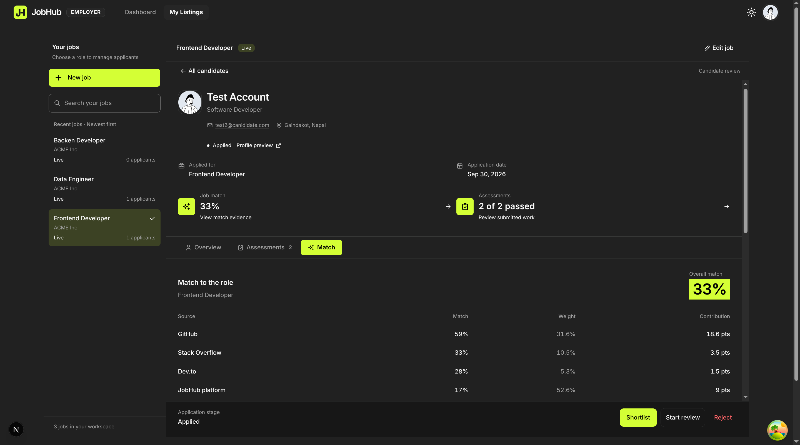</td>
    <td>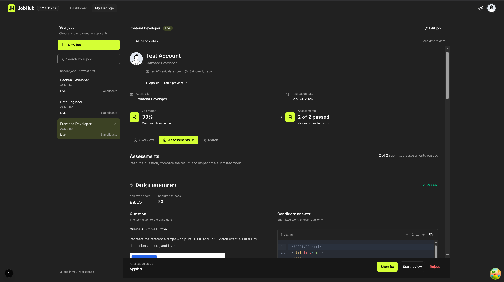</td>
  </tr>
  <tr>
    <td align="center"><sub>Candidate match evidence</sub></td>
    <td align="center"><sub>Reviewing submitted assessments</sub></td>
  </tr>
</table>

### Collaboration projects

Candidates can post a **project** they want to build, list the **roles** they need, and invite people or accept join requests.

What sets this apart is **gap-based recommendations**. The job matcher ranks people by how much they _resemble_ a role. The collaboration engine instead ranks people by how much of the team's **missing skills** they cover. It works out what the project needs that nobody on the team covers yet and recommends people for that. When someone joins, the gap changes and the recommendations update.

<table>
  <tr>
    <td>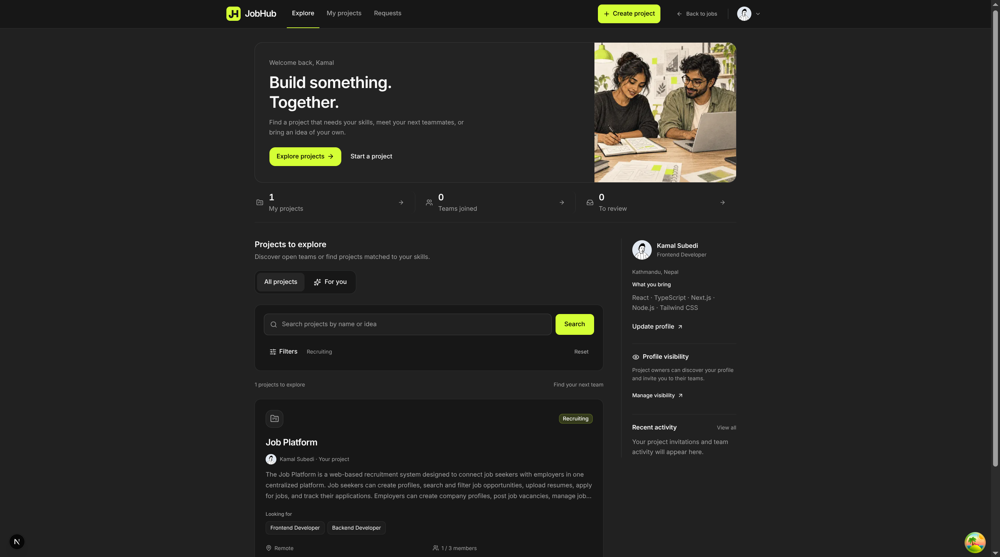</td>
    <td>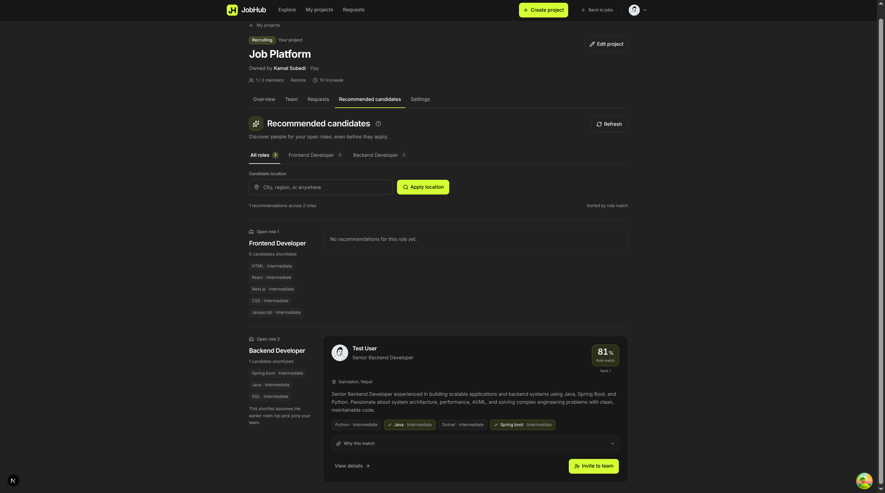</td>
  </tr>
  <tr>
    <td align="center"><sub>Discover and create projects</sub></td>
    <td align="center"><sub>Recommended candidates per open role</sub></td>
  </tr>
</table>

---

## How matching works

1. **Embedding model.** A dual encoder built on **Longformer** (`allenai/longformer-base-4096`) with mean pooling and a 768 → 256 projection. It turns long resumes and job descriptions (up to 2048 tokens) into normalised 256-dimensional vectors. It was fine-tuned on resume/job pairs labelled _No Fit / Potential Fit / Good Fit_ so that cosine similarity reflects job fit.
2. **Profile sources.** The backend embeds the candidate's JobHub profile and each connected platform separately and stores the vectors in PostgreSQL using **pgvector**.
3. **Weighted score.** Each source is compared with the job embedding by cosine similarity, then combined using these weights:

   | Source         | Weight |
   | -------------- | ------ |
   | JobHub profile | 50%    |
   | GitHub         | 30%    |
   | Stack Overflow | 10%    |
   | Dev.to         | 5%     |
   | ORCID          | 5%     |

   If a source isn't connected, the remaining weights are rescaled, so candidates aren't penalised for platforms they don't use. Both candidates and employers can see this breakdown.

---

## System architecture

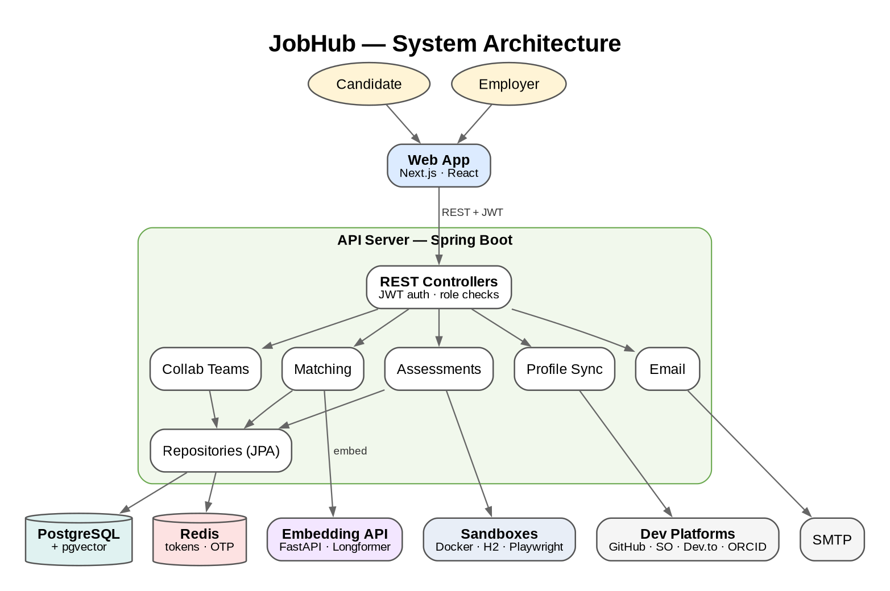

| Component                               | Role                                                                                                            |
| --------------------------------------- | --------------------------------------------------------------------------------------------------------------- |
| **Web app** (`jobhubfrontend/`)         | Next.js and React UI for candidates, employers and collaboration. Talks to the API over REST with JWT auth.     |
| **API server** (`backend/`)             | Spring Boot service for auth, jobs, applications, matching, assessments, collaboration, profile sync and email. |
| **Embedding API** (`machine_learning/`) | FastAPI service that serves the trained Longformer dual encoder (`POST /embed`).                                |
| **PostgreSQL + pgvector**               | Main data store, including embedding vectors.                                                                   |
| **Redis**                               | Refresh tokens and email OTPs.                                                                                  |
| **Sandboxes**                           | Docker (Java/Python code), H2 (SQL) and Playwright (design rendering) for grading assessments.                  |
| **External platforms**                  | GitHub, Stack Overflow, Dev.to and ORCID APIs for profile sync; SMTP for email.                                 |

---

## Tech stack

| Layer                | Technologies                                                                                                      |
| -------------------- | ----------------------------------------------------------------------------------------------------------------- |
| Frontend             | Next.js, React, TypeScript, Tailwind CSS, TanStack Query, NextAuth, CodeMirror                                    |
| Backend              | Java 17, Kotlin, Spring Boot (Web MVC, Security, Data JPA, Redis, Mail), JWT, Hibernate Vector, springdoc OpenAPI |
| Machine learning     | Python, PyTorch, Hugging Face Transformers, FastAPI                                                               |
| Data                 | PostgreSQL + pgvector, Redis                                                                                      |
| Assessment sandboxes | Docker, H2, Playwright (Chromium)                                                                                 |
| CI/CD                | GitHub Actions (backend Docker image to GHCR)                                                                     |

---

## Repository structure

```text
JobHub/
├── backend/            # Spring Boot API server       (see backend/README.md)
├── jobhubfrontend/     # Next.js web app              (see jobhubfrontend/README.md)
├── machine_learning/   # Embedding model + FastAPI    (see machine_learning/README.md)
├── imgs/               # Screenshots and diagrams used in this README
└── .github/workflows/  # CI: backend Docker image build
```

Each module has its own README with setup and run instructions.
